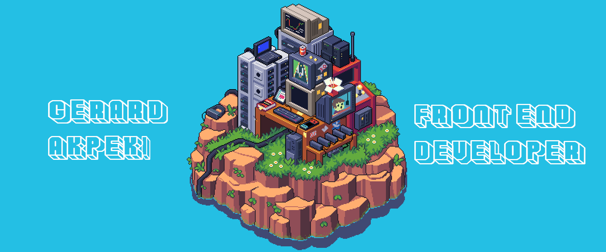

 

  

Welcome to my GitHub! I'm a passionate and innovative front-end web developer with an unwavering commitment to creating visually stunning and user-centric digital experiences. I am also: 

     <ul>
      <li> 🔭 Proficient - in HTML/CSS/JS</li>
      <li> 🌱 Continuous learner - very passionate about acquiring more knowledge daily</li>
      <li> 👯 Meticulous - my level of perfectionism is giving Virgo</li>
      <li> 🎯 Diligent - i treat all my projects like my babies</li>
      <li> 🏋 Equanimity - my mind is composed and steady under high levels of pressure</li>
      <li> 📫 Agile - in a constant state of acclimatization</li>
      <li> ⚡ Tenacious - persistently determined to solve problems</li>
</ul>
 <button type="button">CV</button>
 <a href="CV - Gerard Akpeki.pdf">Take a Look at my CV!</a>
<!--
**ZhoraEbashitEbalo/ZhoraEbashitEbalo** is a ✨ _special_ ✨ repository because its `README.md` (this file) appears on your GitHub profile.

Here are some ideas to get you started:

-->
